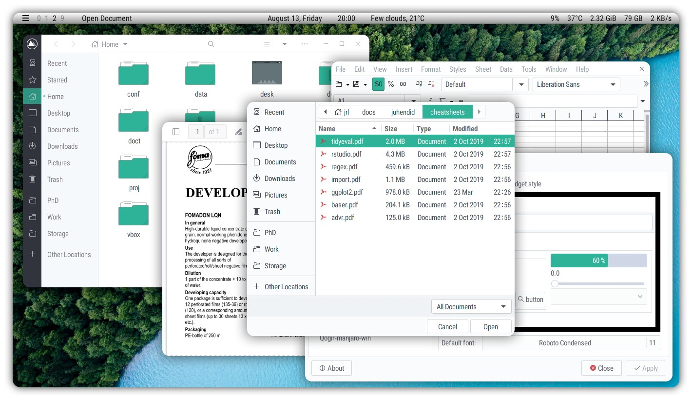
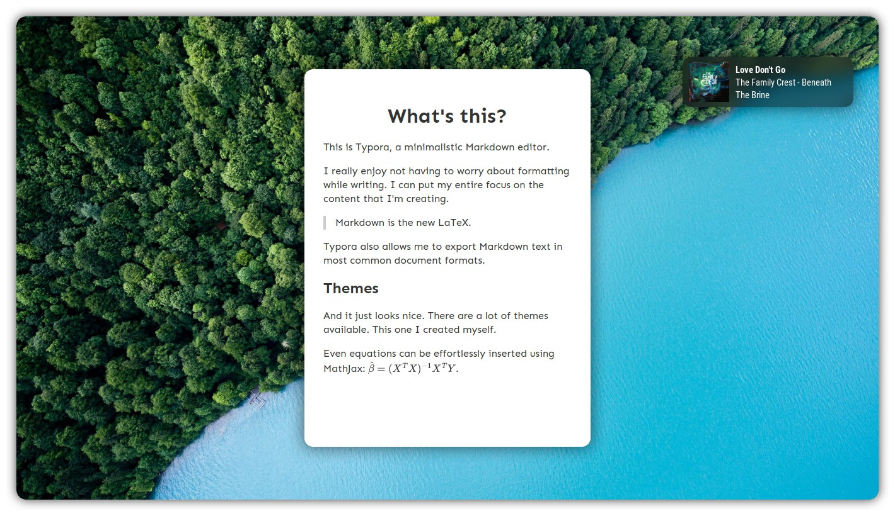
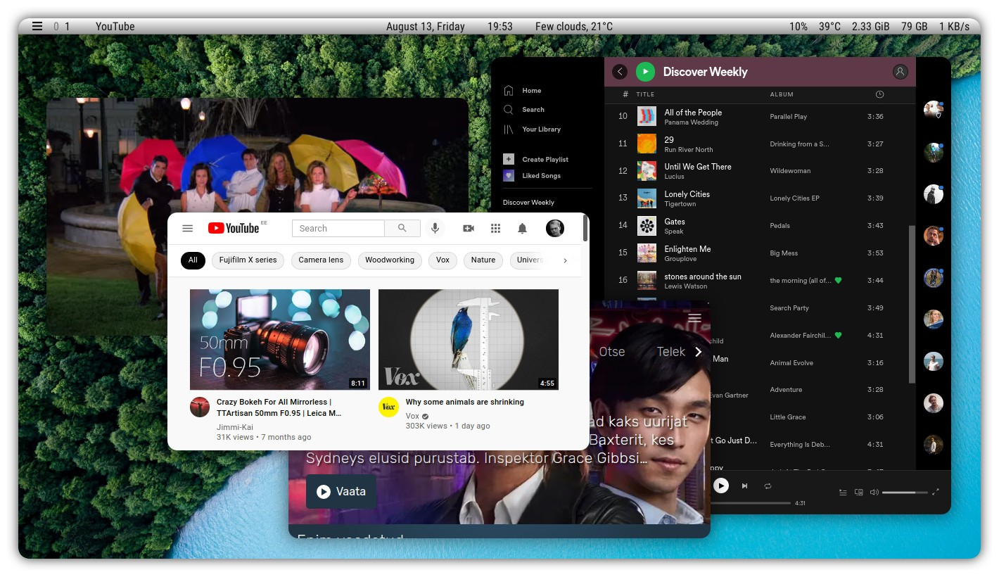
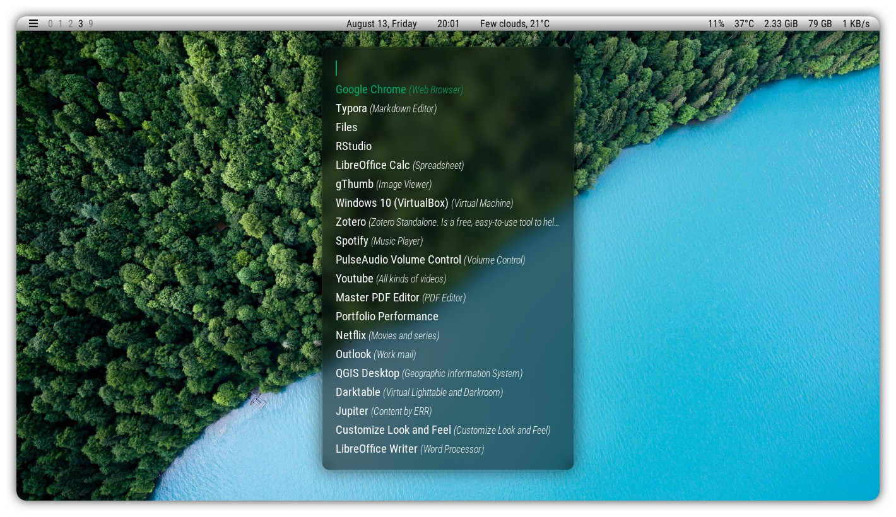
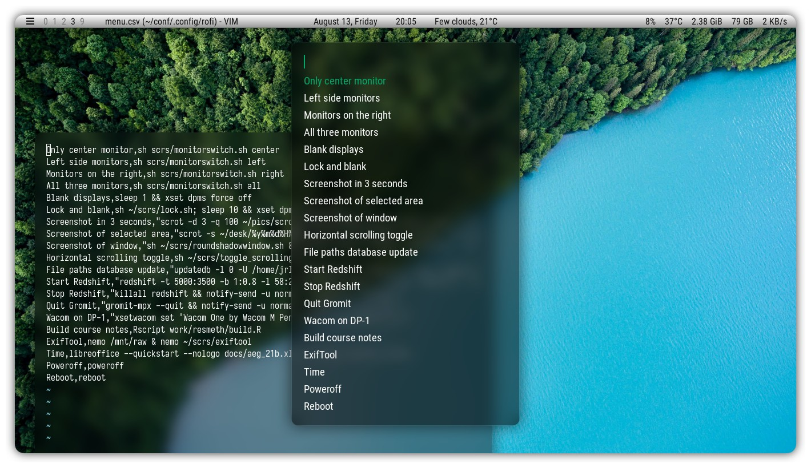

# Configuration

This repository contains configuration files that define how my Linux system looks and feels. The software used is listed below.

- The desktop is served by [i3 window manager](https://i3wm.org/) (the [version with gaps](https://github.com/Airblader/i3)). 
- Window compositing is provided by Picom ([picom-ibhagwan-git](https://github.com/ibhagwan/picom-ibhagwan-git)). 
- The top bar is [Polybar](https://github.com/polybar/polybar).
- [Rofi](https://github.com/davatorium/rofi) takes care of app launcing, window switching, opening files and running custom scripts. 
- System notifications and prompts are displayed by [Dunst](https://github.com/dunst-project/dunst).
- The wallpaper is not included in the repository but can likely be dug up by searching for [Lake Brienz](https://www.google.com/search?q=lake+brienz+wallpaper).

## Preview

### Terminals

Alacritty windows have just enough darkness and blur to be readable while remaining aesthetic. The monospace font is [Iosevka](https://github.com/be5invis/Iosevka) and color scheme is Monokai that nicely matches the wallpaper.

### Graphical apps

The minimal flat look of GUI apps is produced by the Manjaro flavor of [Qogir](https://github.com/vinceliuice/Qogir-theme) GTK theme. The theme has also matching icons and cursors. Even Qt apps follow this theming due to `export QT_QPA_PLATFORMTHEME=gtk3` in the `.xinitrc`. 

### 

### Distraction-free writing

I use Markdown with [Typora](https://typora.io/) for all of my writing (unless forced to work with `.docx` files). By hiding Polybar with a simple key binding, I can quicly unclutter the desktop. Okay, that accidental Dunst prompt can be distracting but can be avoided by not listening to music while writing.

### Media in kiosk

Because toolbars are unnecessary when streaming media via Netflix or YouTube, I run such websites in kiosk mode on Google Chrome. These can be launched just like any other app due to custom `.desktop` files in `.local/share/applications`.

### Launcher

Apps are launched via Rofi that is displayed when clicking on the icon on left side of the bar or a key binding on keyboard. The background is chosen to match that of Alacritty.

Nice thing about Rofi is that in can be configured to lauhch anyting. I also use it to quickly run custom scripts that can be defined in a simple `.csv` file.

